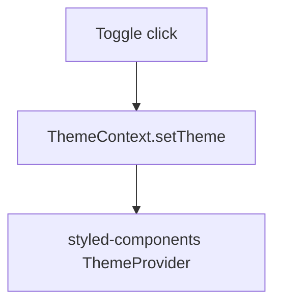

# Feature Spec: Plan Mode

**Status**: 📋 PLANNED (PARTIAL — `TaskPlanner.ts` + `services/ai/planning/` already do single-shot AI task decomposition, but there is no first-class, interruptible Plan Mode)
**Priority**: HIGH
**Effort**: M (1-2wk) — reuses existing planning pipeline; net-new work is the UI toggle, clarifying-questions flow, markdown persistence, and dispatch wiring
**Competitor parity**: Cursor Plan Mode (Shift+Tab) — research-first, clarify-before-code, plan-as-artifact
**Dependencies**: `zustand`, existing `TaskPlanner`/`planning/*`, `SemanticSearchService`, `WorkspaceService`, `TaskQueue`, `AgentOrchestrator`, Tauri `fs` plugin for `.vcs/plans/*.md`, `mermaid` (render-only, npm) for optional diagrams

---

## User Story

As a developer using Agent Mode, I want to trigger a research-and-clarify planning pass before any code is written, so that I can review and correct the agent's understanding of the task while it is still cheap to change, instead of discovering a wrong approach after files have already been edited.

## Why VCS lacks this today

`TaskPlanner.planTask()` (`src/services/ai/TaskPlanner.ts`) already calls `analyzeProjectBeforePlanning()` and `buildPlanningPrompt()` from `src/services/ai/planning/` to produce an `AgentTask` with `AgentStep[]` — but this happens synchronously inside one AI call, is not interruptible, never asks the user a clarifying question, and produces an in-memory `TaskPlanResponse` rather than a durable, human-editable artifact. There is no toggle in `EnhancedAgentMode` that separates "plan" from "execute."

## Acceptance Criteria

1. ⬜ Shift+Tab (configurable) toggles Plan Mode on/off inside `EnhancedAgentMode`, visible as a mode badge next to the existing `StatusIndicator`.
2. ⬜ Entering Plan Mode with a task description runs a **research pass** — no file writes — that queries `SemanticSearchService` for relevant symbols/files and `WorkspaceService` for structure, feeding results into `PlanningContext` alongside the existing `projectAnalysis`.
3. ⬜ If `AGENTS.md` exists at workspace root (per spec 03), its contents are injected into the planning prompt as authoritative project conventions before generation.
4. ⬜ When the AI's confidence is low or the request is ambiguous, the system surfaces 1-5 clarifying questions in a dedicated UI panel; execution is blocked until answered or explicitly skipped.
5. ⬜ A structured markdown plan is written to `<workspaceRoot>/.vcs/plans/<slug>-<timestamp>.md` containing: goal, assumptions, file-level to-do list, and (optionally) a Mermaid diagram of the change's data/control flow.
6. ⬜ The plan file is the single source of truth: editing it in Monaco and re-triggering "Dispatch" re-parses the file rather than re-running the AI from scratch.
7. ⬜ "Dispatch Plan" converts each markdown to-do into a `TaskQueue` entry routed through `AgentOrchestrator`, preserving order and per-item checkpoints.
8. ⬜ Each dispatched to-do reports progress back into the plan file (checkbox `[x]`) so the on-disk artifact stays in sync with execution.
9. ⬜ Plan Mode sessions are cancellable at the research, clarify, or dispatch stage without leaving partial file writes.
10. ⬜ A history list of past plan files under `.vcs/plans/` is browsable from the sidebar for reuse/reference.
11. ⬜ Re-opening a previously generated plan file restores `planModeStore` to the `ready` stage with its steps and diagram intact, rather than forcing a fresh research pass.
12. ⬜ The research pass results (files/symbols consulted) are shown to the user before generation, so a wrong research scope can be corrected without burning an AI call.

## Architecture / Solution

Plan Mode is a state machine layered on top of the existing planning facade, not a replacement for it. It runs entirely in the React/webview layer for orchestration; the only new Rust surface is file I/O for `.vcs/plans/` via the Tauri `fs` plugin (scoped to the workspace directory, same pattern already used for other workspace-relative writes) — no new sidecar process is needed since `TaskPlanner` already calls out to the AI service over HTTP from the webview.

The state machine is deliberately linear and resumable: each stage transition persists enough state (in `planModeStore`, mirrored to the plan markdown's frontmatter `status` field) that closing and reopening the workspace mid-plan does not lose progress. `researching` and `generating` are the only stages that call out to the AI service; `clarifying`, `ready`, and `dispatching` are pure local state plus file I/O, which keeps the expensive/slow steps isolated and retryable independently.

```
User task text
   -> [Research] SemanticSearchService.search() + WorkspaceService.getStructure()
        -> merged into PlanningContext (extends existing type in planning/types.ts)
   -> [Clarify] TaskPlanner emits low-confidence markers -> ClarifyingQuestionsPanel
        -> answers merged back into PlanningContext
   -> [Generate] buildPlanningPrompt() + AGENTS.md content -> aiService.sendContextualMessage()
        -> parseTaskPlan() -> AgentTask
   -> [Persist] AgentTask -> markdown serializer -> .vcs/plans/<slug>.md (Tauri fs.writeTextFile)
   -> [Dispatch] markdown parser -> AgentStep[] -> TaskQueue.enqueue() per step
        -> AgentOrchestrator executes, writes checkpoint status back to markdown
```

State lives in a new `planModeStore` (zustand), sibling to `agentModeStore.ts`, with stages `idle | researching | clarifying | generating | ready | dispatching`. Each stage exposes its own error boundary so a failure in, say, `generating` (AI service timeout) surfaces as a retryable error on that stage alone rather than resetting the whole session back to `idle` and discarding the research findings already gathered.

**Data model** (types added to `src/services/ai/planning/types.ts`):

```ts
interface PlanSession {
  id: string;
  stage: 'idle' | 'researching' | 'clarifying' | 'generating' | 'ready' | 'dispatching';
  researchFindings?: { files: string[]; symbols: string[] };
  clarifyingQuestions?: { question: string; answer?: string }[];
  planFilePath?: string; // .vcs/plans/<slug>.md once persisted
  dispatchedStepIds?: string[];
}
```

`PlanSession` is the shape persisted to `planModeStore` and mirrored (minus transient UI state) into the markdown frontmatter, so the file itself is enough to reconstruct where a session left off.

Markdown plan shape (frontmatter + sections), generated from `AgentTask`:

````markdown
---
slug: add-dark-mode-toggle
created: 2026-07-03T10:00:00Z
status: ready
---

## Goal

<from AgentTask.description>

## Assumptions

- <clarifying Q&A pairs>

## Steps

- [ ] 1. Add ThemeContext (src/contexts/ThemeContext.tsx)
- [ ] 2. Wire toggle into SettingsPanel

## Diagram


````

```

## Implementation (phased)
### Phase 1 — Research pass + plan markdown
Extend `PlanningContext` (in `src/services/ai/planning/types.ts`) with a `researchFindings` field. Add a research step to `TaskPlanner.planTask()` that calls `SemanticSearchService` and `WorkspaceService` before `buildPlanningPrompt()`. Add a markdown serializer/parser pair (`src/services/ai/planning/PlanMarkdown.ts`) and wire `.vcs/plans/` read/write through Tauri's `fs` plugin.

### Phase 2 — Clarifying-questions UI
Add `ClarifyingQuestionsPanel.tsx` under `src/components/EnhancedAgentMode/components/`, following the existing pattern of `ContextPanel`/`AgentPanel`. Extend `ResponseParser` to detect and extract question markers from the AI's planning response. Block the "Dispatch" action in `planModeStore` until questions are resolved or explicitly dismissed.

### Phase 3 — Dispatch + Mermaid + checkpoints
Add `PlanDispatcher.ts` that parses the on-disk markdown checklist into `AgentStep[]`, enqueues via `TaskQueue`, and subscribes to `AgentOrchestrator` completion events to rewrite checkbox state in the markdown file. Add Mermaid rendering (client-side, `mermaid` npm package, dynamic import to keep bundle small) inside the plan preview pane in Monaco (or a split markdown-preview panel). Checkpoints are per-step: if step 3 of 6 fails, steps 1-2 stay checked, step 3 shows an error marker inline in the markdown (`- [!] 3. ...`), and steps 4-6 remain unchecked and undispatched until the user resolves step 3 and re-triggers dispatch for the remainder.

Each phase should land behind a feature flag so Plan Mode can be dogfooded on a subset of tasks before becoming the default Agent Mode entry point, given it changes the interaction model for every non-trivial task.

## Integration points (existing code to hook into)
- `src/services/ai/TaskPlanner.ts` — extend `planTask()` with a research pre-pass; reuse `planTaskWithConfidence()` for per-step confidence used to trigger clarifying questions.
- `src/services/ai/planning/` (`PromptBuilder.ts`, `ResponseParser.ts`, `types.ts`) — extend `PlanningContext`, add question-extraction to `ResponseParser`.
- `src/components/EnhancedAgentMode/` — add Plan Mode toggle in `EnhancedAgentMode.tsx` header, new `planModeStore.ts` beside `stores/agentModeStore.ts`, new `ClarifyingQuestionsPanel` component beside existing `components/`.
- `src/services/SemanticSearchService.ts` — source of research-pass context.
- `src/services/WorkspaceService.ts` — source of project structure for research pass.
- `src/services/TaskQueue.ts` — dispatch target for parsed plan steps.
- `src/services/specialized-agents/AgentOrchestrator.ts` — executes dispatched steps and reports checkpoint completion.

## Test Scenarios
- Vitest: `PlanMarkdown.serialize(agentTask)` round-trips through `PlanMarkdown.parse()` producing an equivalent `AgentStep[]`.
- Vitest: `planModeStore` transitions `idle -> researching -> clarifying` only when confidence < threshold; skips straight to `generating` otherwise.
- Vitest: `ResponseParser` extracts clarifying questions from a fixture AI response containing `[CLARIFY: ...]` markers.
- Vitest: `PlanMarkdown.parse()` on a manually-edited plan file (steps added/removed by the user in Monaco) produces an `AgentStep[]` reflecting the edits, not the original AI output.
- Playwright: open Agent Mode, press Shift+Tab, type a task, assert a `.vcs/plans/*.md` file is created in the test workspace fixture and its content contains a `## Steps` section.
- Playwright: answer a clarifying question in the panel, click Dispatch, assert `TaskQueue` receives one enqueue call per unchecked markdown to-do.
- Playwright: cancel a Plan Mode session mid-`researching`; assert no `.vcs/plans/*.md` file was written and `planModeStore` returns to `idle`.

## Success Metrics
- >80% of Agent Mode sessions on non-trivial tasks (>3 files touched) go through Plan Mode before execution, measured via telemetry event on dispatch.
- Plan-to-execution rework rate (agent re-planning mid-task) drops relative to baseline `TaskPlanner.planTask()` usage.
- Median clarifying-question round-trip < 30s human response time (UX signal, not a hard gate).
- Plan file edit-then-redispatch (Acceptance Criterion 6) is used in >20% of Plan Mode sessions, indicating the markdown-as-source-of-truth model is actually load-bearing rather than decorative.

---
**Risks / Open questions**: Where should `.vcs/` live relative to `.gitignore` defaults — committed (team-shareable plans) or ignored (local scratch)? Recommend committed by default with a per-workspace opt-out. Mermaid rendering adds a dependency; confirm bundle-size impact is acceptable before Phase 3. Clarifying-question false positives (blocking on trivial tasks) need a confidence threshold tuned against `ConfidenceCalculator.ts` output.
**Sequencing**: Wave 1 (foundational). Unblocks spec 09 (plan artifacts reuse this markdown format) and spec 10 (Manager dispatches per-agent plans). Does not block 11.
```
