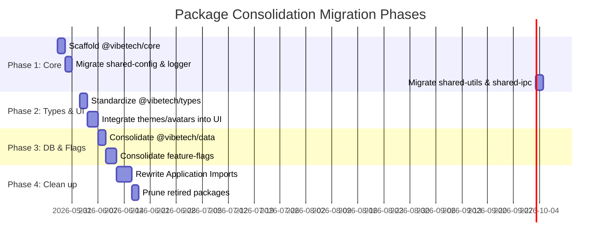

# Package Consolidation Plan (ARCH-1.2)

## 1. Executive Summary
The VibeTech Monorepo currently contains a high number of shared packages (52 packages/apps, with over 35 distinct packages in the `packages/` directory). This fragmentation increases dependency graph complexity, slows down build times, complicates release versioning, and creates friction for developers.

This consolidation plan defines a model to reduce the number of packages to **35-38** (a reduction of 15+ packages), aligning with the target of $\le 40$ packages. It details the merging of shared utility packages, standardization of types and UI components, and consolidates the database and feature flag layers.

---

## 2. Current State Inventory & Fragmentation Analysis
Based on `package-deps-analysis.json` and `dep-graph.json`, the shared packages are fragmented across several categories:

### A. Shared Utilities & Config (6 packages)
*   `@vibetech/shared` (packages/shared) — Database utilities, config, logic.
*   `@vibetech/shared-utils` (packages/shared-utils) — Tailwind/CSS classes merging, crypto-js, etc.
*   `@vibetech/shared-config` (packages/shared-config) — dotenv loader, env validation.
*   `@vibetech/logger` (packages/logger) — Pino/winston logging configuration.
*   `@vibetech/service-common` (packages/service-common) — Express middleware, OpenAI client, jwt.
*   `@vibetech/backend` (packages/backend) — Vector stores, SQLite-vec adapters, IPC clients.

### B. Types Packages (2 packages)
*   `@vibetech/types` (packages/types) — General workspace typescript types.
*   `@nova/types` (packages/nova-types) — Desktop guide specific types.

### C. UI & Design Systems (3 packages)
*   `@vibetech/ui` (packages/ui) — Radix UI components and styles.
*   `@vibetech/vcs-theme` (packages/vcs-theme) — Spacing, colors, theme tokens.
*   `@vibetech/avatars` (packages/avatars) — Avatar images and components.

### D. Feature Flags (6 packages)
*   `@vibetech/feature-flags` — Root folder metadata.
*   `@vibetech/feature-flags-core` — Gating rules and models.
*   `@vibetech/feature-flags-dashboard` — Admin control UI panel.
*   `@vibetech/feature-flags-sdk-node` — Node runtime SDK.
*   `@vibetech/feature-flags-sdk-react` — React hooks and components SDK.
*   `@vibetech/feature-flags-server` — Express/Hono flag evaluation server.

### E. Database Layer (2 packages)
*   `@vibetech/db-app` — Main SQLite connection adapters.
*   `@nova/database` — SQLite services for Nova Agent.

---

## 3. The Consolidation Model
To achieve the target count, we will merge packages into cohesive units using modern Node.js/TypeScript **subpath exports** (`exports` field in `package.json`). This keeps code boundaries clean while reducing the overhead of maintaining individual package manifests, TSConfigs, and build steps.

```mermaid
graph TD
    %% Source Fragmented Packages
    subgraph Fragmented ["Fragmented Packages (Current)"]
        shared["@vibetech/shared"]
        sh_utils["@vibetech/shared-utils"]
        sh_conf["@vibetech/shared-config"]
        logger["@vibetech/logger"]
        serv_com["@vibetech/service-common"]
        backend["@vibetech/backend"]
        
        types_gen["@vibetech/types"]
        types_nova["@nova/types"]
        
        ui_core["@vibetech/ui"]
        ui_theme["@vibetech/vcs-theme"]
        ui_avatars["@vibetech/avatars"]
        
        db_app["@vibetech/db-app"]
        db_nova["@nova/database"]
        
        ff_core["@vibetech/feature-flags-core"]
        ff_node["@vibetech/feature-flags-sdk-node"]
        ff_react["@vibetech/feature-flags-sdk-react"]
        ff_server["@vibetech/feature-flags-server"]
    end

    %% Consolidated Packages
    subgraph Consolidated ["Consolidated Targets (Planned)"]
        core_target["@vibetech/core"]
        types_target["@vibetech/types"]
        ui_target["@vibetech/ui"]
        data_target["@vibetech/data"]
        ff_target["@vibetech/feature-flags"]
    end

    %% Mappings
    shared --> core_target
    sh_utils --> core_target
    sh_conf --> core_target
    logger --> core_target
    serv_com --> core_target
    backend --> core_target
    
    types_gen --> types_target
    types_nova --> types_target
    
    ui_core --> ui_target
    ui_theme --> ui_target
    ui_avatars --> ui_target
    
    db_app --> data_target
    db_nova --> data_target
    
    ff_core --> ff_target
    ff_node --> ff_target
    ff_react --> ff_target
    ff_server --> ff_target
```



### Consolidated Targets (Package Count Reductions)

| Target Consolidated Package | Source Packages to Merge | Impact |
| :--- | :--- | :--- |
| **`@vibetech/core`** (New) | `@vibetech/shared`, `@vibetech/shared-utils`, `@vibetech/shared-config`, `@vibetech/logger`, `@vibetech/service-common`, `@vibetech/backend` | **-5 packages** |
| **`@vibetech/types`** (Standardized) | `@vibetech/types`, `@nova/types` | **-1 package** |
| **`@vibetech/ui`** (Standardized) | `@vibetech/ui`, `@vibetech/vcs-theme`, `@vibetech/avatars` | **-2 packages** |
| **`@vibetech/data`** (New) | `@vibetech/db-app`, `@nova/database` | **-1 package** |
| **`@vibetech/feature-flags`** (Consolidated) | `@vibetech/feature-flags-core`, `@vibetech/feature-flags-server`, `@vibetech/feature-flags-sdk-node`, `@vibetech/feature-flags-sdk-react` (excluding dashboard UI if runtime sizes dictate) | **-3 packages** |

**Total Reduction:** **-12 Node workspaces** (bringing the active package directory count to ~23 and the monorepo-wide total from 52 to **40**).

---

## 4. Specific Target Merges

### 4.1 `@vibetech/core` Consolidation
All utility, configuration, logging, and backend helpers will live in `packages/core` under distinct entry points.

*   **Exports Configuration (`packages/core/package.json`):**
    ```json
    {
      "name": "@vibetech/core",
      "exports": {
        ".": "./dist/index.js",
        "./config": "./dist/config/index.js",
        "./logger": "./dist/logger/index.js",
        "./utils": "./dist/utils/index.js",
        "./ipc": "./dist/ipc/index.js",
        "./service": "./dist/service/index.js"
      }
    }
    ```
*   **Directory Structure:**
    ```
    packages/core/
    ├── src/
    │   ├── config/       (formerly shared-config)
    │   ├── logger/       (formerly logger)
    │   ├── utils/        (formerly shared-utils)
    │   ├── ipc/          (formerly shared-ipc)
    │   ├── service/      (formerly service-common)
    │   └── index.ts      (general re-exports)
    ```

### 4.2 `@vibetech/types` Standardization
Rather than splitting types by application domain (Nova vs Editor vs Web), all typings will be centralized under a single package, utilizing namespace entry points.

*   **Exports Configuration (`packages/types/package.json`):**
    ```json
    {
      "name": "@vibetech/types",
      "exports": {
        ".": "./dist/index.js",
        "./nova": "./dist/nova/index.js",
        "./editor": "./dist/editor/index.js",
        "./ipc": "./dist/ipc/index.js"
      }
    }
    ```

### 4.3 `@vibetech/ui` Standardization
Themes and custom graphics (like avatars) are consolidated into the main UI kit directory.

*   **Directory Structure:**
    ```
    packages/ui/
    ├── src/
    │   ├── components/
    │   ├── theme/        (formerly vcs-theme tokens and classes)
    │   ├── avatars/      (formerly avatars package assets & components)
    │   └── index.ts
    ```
*   **Theme Integration:** The design tokens in `vcs-theme` will be exposed under `@vibetech/ui/theme` and automatically imported by `@vibetech/ui` global styles.

### 4.4 `@vibetech/feature-flags` Consolidation
Instead of publishing separate packages for react hooks vs node client, we bundle them together using conditional exports to prevent bundling node-dependent libraries in react apps (and vice-versa).

*   **Exports Configuration:**
    ```json
    {
      "name": "@vibetech/feature-flags",
      "exports": {
        "./core": "./dist/core/index.js",
        "./node": {
          "import": "./dist/sdk-node/index.mjs",
          "require": "./dist/sdk-node/index.js"
        },
        "./react": {
          "import": "./dist/sdk-react/index.mjs",
          "require": "./dist/sdk-react/index.js"
        },
        "./server": "./dist/server/index.js"
      }
    }
    ```

---

## 5. Migration Strategy & Dependency Alignment

### Step-by-Step Migration Guide
To minimize development disruption, the migration must be done in sequential phases:



#### Phase 1: Core Infrastructure (`@vibetech/core`)
1.  Create `packages/core` directory.
2.  Copy code files from `shared-config`, `logger`, `shared-utils`, `shared-ipc`, and `service-common` into `packages/core/src/`.
3.  Establish `tsconfig.json` and build scripts using `tsup` to emit ESM and CommonJS for all entry points.
4.  Run unit tests inside `packages/core` and ensure green status.

#### Phase 2: Refactoring Application Imports
1.  Use search-and-replace scripts (or AST codemods) to update application files.
    *   `@vibetech/shared-config` $\rightarrow$ `@vibetech/core/config`
    *   `@vibetech/logger` $\rightarrow$ `@vibetech/core/logger`
    *   `@vibetech/shared-utils` $\rightarrow$ `@vibetech/core/utils`
    *   `@vibetech/shared-ipc` $\rightarrow$ `@vibetech/core/ipc`
2.  Update all consumer `package.json` files to depend on `@vibetech/core` instead of the legacy individual packages.
3.  Run `pnpm install` and verify the lockfile matches.

#### Phase 3: Types and UI Consolidation
1.  Move `@nova/types` to `packages/types/src/nova/`.
2.  Move `@vibetech/vcs-theme` and `@vibetech/avatars` to `packages/ui/src/theme/` and `packages/ui/src/avatars/`.
3.  Update consumers to import from `@vibetech/types/nova` and `@vibetech/ui`.

#### Phase 4: Pruning Stale Packages
1.  Remove old package directories from `packages/`.
2.  Remove workspaces configurations from `pnpm-workspace.yaml`.
3.  Verify monorepo health via `pnpm run workspace:health`.

---

## 6. Potential Breaking Changes & Remediation

### 6.1 bundler resolution errors (Webpack / Rollup / Vite / Tauri)
*   **Risk:** Application bundlers might fail to resolve exports paths (like `@vibetech/core/config`) without appropriate tsconfig/bundler configuration.
*   **Remediation:** Configure `moduleResolution: "bundler"` in `tsconfig.base.json`. Ensure `package.json` defines type declarations for all entry points using `"types"` mappings in `exports`.

### 6.2 Electron/Tauri Packaging Externalization
*   **Risk:** Tauri (`nova-agent`) and Electron (`vibe-code-studio`, `vibetech-command-center`) bundle workspace packages. If packages are combined, the exclusion config in `rollupOptions.external` must be updated.
*   **Remediation:** Update `rollupOptions.external` in electron-builder configs to reference `@vibetech/core` instead of the old split package names to prevent duplicate dependency bundling.

### 6.3 Environment Isolation (Node vs Browser)
*   **Risk:** Consolidating utility modules could lead to server-side code (like Pino file logging, resend, winston) being imported into browser environments, resulting in build-time failures (e.g. `fs` and `path` not found).
*   **Remediation:** Enforce strict environment isolation by using separate entry points (e.g. `@vibetech/core/utils` contains browser-safe helpers, while `@vibetech/core/service` is node-only). Ensure Vite does not analyze node-only branches.
