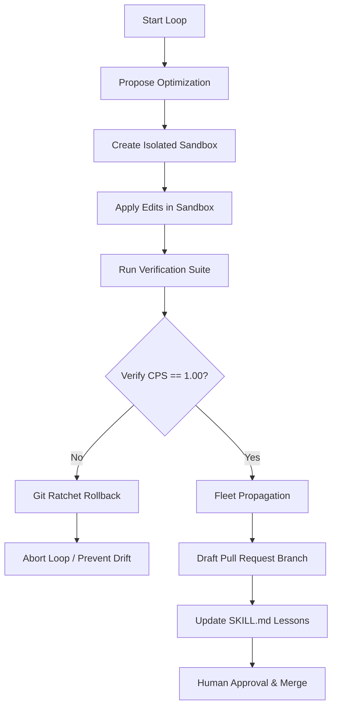

# Ralph AI — Self-Improvement Gym & SAHOO Git Ratchet

This document describes the recursive self-improvement gym, constraint preservation safeguards, and rollback mechanics implemented in the Ralph toolkit (`tools/ralph`).

---

## 1. Architecture Overview



---

## 2. Gym Sandbox Isolation

To prevent experimental changes from corrupting the development environment or escaping execution limits, the gym implements a tiered sandboxing strategy:

### A. Primary Mode: Containerized Docker Sandbox
- **Mount Policy**: The host repository `V:\monorepo` is mounted inside the container as **read-only** (`-v V:\monorepo:/workspace-src:ro`).
- **Isolation**: The container performs a local `git clone` of `/workspace-src` to an internal `/sandbox` directory.
- **Security**: Runs under the unprivileged `node` user in the container, meaning any code modifications are run with restricted permissions.
- **Lifecycle**: The container is spun up for execution and automatically stopped and removed after evaluation completes.

### B. Fallback Mode: Local Directory Sandbox
- If Docker is not available on the host system, the script gracefully falls back to local folder isolation.
- Clones `V:\monorepo` into `D:\tmp-sandbox-ralph-<timestamp>` (residing on the ReFS Dev Drive / data drive).
- Executes changes and verification locally in the isolated staging directory, keeping the host git working directory clean.

---

## 3. The Karpathy Loop

A continuous improvement loop executing three distinct phases:
1. **(A) Propose**: The gym reads the target code file and sends it to the configured Groq LLM (e.g. `llama-3.3-70b-versatile`) requesting a performance, safety, or lint optimization.
2. **(B) Edit**: Edits are applied directly inside the sandboxed clone.
3. **(C) Evaluate**: The verification suite is run against the sandboxed codebase.

---

## 4. SAHOO Safeguards (Constraint Preservation)

Any code optimization must prove it preserves all repository constraints.
- **Score Calculation**:
  - The gym executes `.agent/scripts/verify_all.py` (or `.agent/scripts/checklist.py` for faster core checks) inside the sandbox.
  - The **Constraint Preservation Score (CPS)** is computed based on the verification result.
  - If the validation command returns exit code `0`, `CPS = 1.00` (Passed).
  - If any check fails, types mismatch, or lints fail, `CPS < 1.00` (Failed).

---

## 5. The Git Ratchet Guardrail

- **Failure Response**: If `CPS < 1.00`, the sandbox executes `git reset --hard` and `git clean -fd` to immediately discard the proposed changes. The loop aborts to prevent alignment drift and avoid propagating bugs.
- **Success Response**: If `CPS == 1.00`, the changes are preserved and passed to the Fleet Propagation stage.

---

## 6. Fleet Propagation

On verification success, the gym propagates the improvement to the agent network:
1. **Git Branch Creation**: Creates a new branch `ralph-opt-<skill-name>-<timestamp>` on the host.
2. **Code Integration**: Applies the optimized code to the host file.
3. **Skill Update**: Appends the new optimization lesson learned to the relevant skill file (e.g., `.agent/skills/<skill-name>/SKILL.md`).
4. **Commit**: Commits the changes locally under the message: `ralph(opt): self-improvement lesson learned in <skill-name>`, awaiting human approval via pull request.

---

## 7. Command Reference

### Run Simulation (Recommended for Testing Sandbox Pipeline)
```powershell
python tools/ralph/gym_runner.py --simulate --checklist
```

### Run Full Self-Improvement Loop
Ensure `GROQ_API_KEY` is configured in `V:\monorepo\.env`.
```powershell
# Run 1 loop on the default scorer target, updating clean-code skill
python tools/ralph/gym_runner.py --target tools/ralph/src/scorer.py --skill clean-code

# Run multiple loops with verification URL
python tools/ralph/gym_runner.py --target tools/ralph/src/scanner.py --loops 3 --url http://localhost:3001
```
